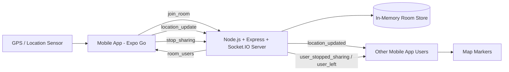
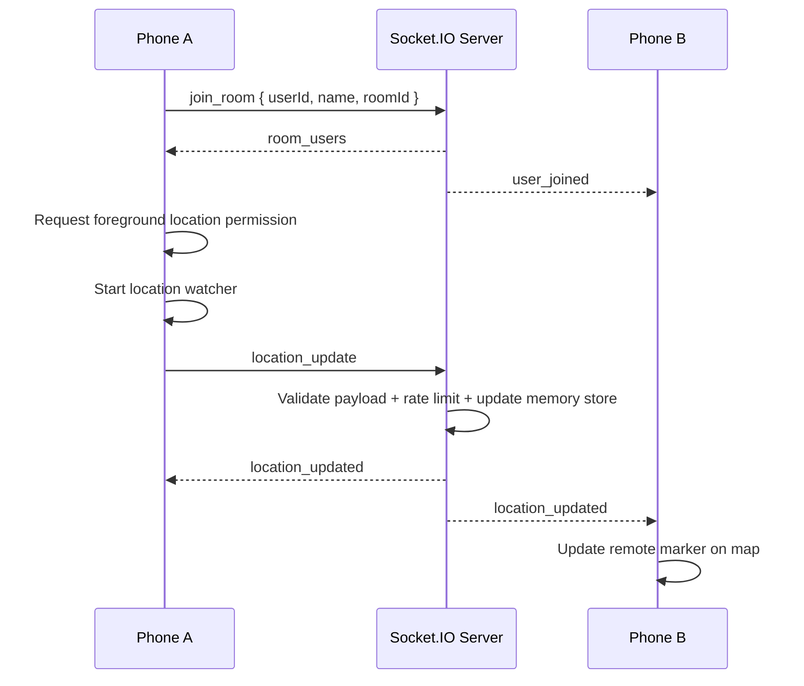

# Mobile Computing: LiveMap Application

> Aplikasi mobile realtime location sharing berbasis room untuk demonstrasi konsep mobile computing menggunakan Expo React Native, GPS sensor, peta, dan Socket.IO.


## Table of Contents

- [Overview](#overview)
- [Key Features](#key-features)
- [Why This Is Mobile Computing](#why-this-is-mobile-computing)
- [Tech Stack](#tech-stack)
- [Architecture](#architecture)
- [Realtime Flow](#realtime-flow)
- [Project Structure](#project-structure)
- [Server Details](#server-details)
- [Mobile App Details](#mobile-app-details)
- [Environment Variables](#environment-variables)
- [Running Locally on Same WiFi](#running-locally-on-same-wifi)
- [Running Across Different Networks with ngrok](#running-across-different-networks-with-ngrok)
- [Testing Guide](#testing-guide)
- [Troubleshooting](#troubleshooting)
- [Known Limitations](#known-limitations)
- [Future Improvements](#future-improvements)
- [Project Status](#project-status)

## Overview

**Mobile Computing: LiveMap Application** adalah aplikasi mobile untuk berbagi lokasi secara realtime. Pengguna memasukkan nama dan Room ID, bergabung ke room yang sama, menekan tombol **Start Sharing**, lalu perangkat mobile membaca lokasi foreground melalui GPS/location sensor dan mengirimkannya ke server Socket.IO.

Server menyimpan state room secara in-memory, memvalidasi payload, menerapkan rate limit, lalu menyiarkan update lokasi hanya ke pengguna yang berada di room yang sama. Aplikasi mobile lain yang berada di room tersebut menerima update dan menampilkan marker pengguna secara realtime di peta.

Masalah utama yang diselesaikan proyek ini adalah kebutuhan untuk melihat posisi beberapa pengguna mobile dalam satu sesi realtime tanpa login, tanpa database, dan tanpa background tracking. Pendekatan ini cocok untuk demonstrasi akademik/mobile computing karena menampilkan integrasi sensor perangkat, jaringan nirkabel, komunikasi realtime, dan visualisasi peta.

## Key Features

- **Join room**: pengguna masuk ke room menggunakan nama dan Room ID.
- **Realtime location sharing**: lokasi foreground dikirim melalui event `location_update`.
- **Multi-user map markers**: pengguna lain di room yang sama muncul sebagai marker pada peta.
- **Automatic marker updates**: marker diperbarui otomatis saat event `location_updated` diterima.
- **Stop sharing**: pengguna dapat menghentikan location watcher dan mengirim `stop_sharing`.
- **Reconnect handling**: client menyimpan sesi aktif dan otomatis re-emit `join_room` setelah reconnect.
- **Cross-network access with ngrok**: server lokal dapat diekspos untuk perangkat di jaringan berbeda.
- **Expo Go support**: aplikasi mobile dapat dijalankan langsung dari Expo Go untuk demo dan pengujian.
- **Room isolation**: update lokasi hanya dikirim ke Socket.IO room yang sesuai.
- **Validation and rate limiting**: server memvalidasi payload dan membatasi update lokasi maksimal satu update per pengguna per detik.

## Why This Is Mobile Computing

Proyek ini termasuk aplikasi **mobile computing** karena menggabungkan elemen-elemen berikut:

- **Mobile devices**: aplikasi berjalan pada smartphone melalui Expo Go.
- **GPS/location sensor**: perangkat membaca lokasi pengguna menggunakan `expo-location`.
- **Wireless network/internet**: data dikirim melalui WiFi, hotspot, jaringan seluler, atau tunnel internet.
- **Realtime communication**: komunikasi client-server berjalan melalui Socket.IO.
- **Map visualization**: posisi pengguna divisualisasikan dengan `react-native-maps`.
- **User mobility**: marker dapat berubah mengikuti pergerakan pengguna selama aplikasi aktif dan sharing berjalan.

## Tech Stack

| Layer | Technology | Purpose |
|---|---|---|
| Mobile App | Expo React Native | Framework aplikasi mobile yang dapat berjalan di Expo Go |
| Language | TypeScript | Type safety untuk mobile dan server |
| Location | `expo-location` | Permission, current position, dan foreground location watcher |
| Map | `react-native-maps` | Menampilkan peta, own marker, dan remote markers |
| Realtime Client | Socket.IO Client | Koneksi realtime dari mobile ke server |
| Backend Runtime | Node.js | Runtime server |
| HTTP Server | Express | Health endpoint dan fondasi HTTP server |
| Realtime Server | Socket.IO Server | Room, event realtime, broadcast lokasi |
| Cross-network Tunnel | ngrok | Mengekspos server lokal agar dapat diakses dari jaringan berbeda |

## Architecture



Arsitektur proyek dibagi menjadi dua bagian utama:

1. **Mobile app** bertanggung jawab terhadap UI, permission lokasi, watcher foreground location, pengiriman event Socket.IO, dan rendering marker.
2. **Server** bertanggung jawab terhadap validasi payload, manajemen room, penyimpanan state sementara di memory, rate limiting, dan room-scoped broadcast.

## Realtime Flow



Alur realtime:

1. User mengisi nama dan Room ID.
2. Aplikasi menghubungkan Socket.IO client dan mengirim `join_room`.
3. User menekan **Start Sharing**.
4. Aplikasi meminta foreground location permission.
5. Aplikasi membaca GPS/current position dan menjalankan foreground watcher.
6. Aplikasi mengirim `location_update` berisi koordinat, accuracy, speed, heading, dan timestamp.
7. Server memvalidasi payload dan menyimpan lokasi terakhir di memory.
8. Server broadcast `location_updated` ke semua user di room yang sama, termasuk pengirim.
9. Aplikasi client memperbarui own marker dari lokasi lokal dan remote marker dari event server.

## Project Structure

```text
mobile-computing-livemap-application/
├── mobile/
│   ├── App.tsx
│   ├── app.json
│   ├── index.ts
│   ├── package.json
│   ├── tsconfig.json
│   ├── .env
│   └── src/
│       ├── components/
│       ├── hooks/
│       │   ├── useLocationSharing.ts
│       │   └── useSocket.ts
│       ├── screens/
│       │   ├── JoinRoomScreen.tsx
│       │   └── LiveMapScreen.tsx
│       ├── services/
│       │   └── socket.ts
│       ├── types/
│       │   └── realtime.ts
│       └── utils/
│           ├── formatTimeAgo.ts
│           ├── generateUserId.ts
│           └── locationUtils.ts
├── server/
│   ├── package.json
│   ├── tsconfig.json
│   ├── .env.example
│   └── src/
│       ├── index.ts
│       ├── rateLimit.ts
│       ├── roomStore.ts
│       ├── types.ts
│       └── validators.ts
└── README.md
```

### Important Folders and Files

| Path | Purpose |
|---|---|
| `README.md` | Dokumentasi utama proyek, setup, testing, dan troubleshooting |
| `mobile/` | Aplikasi Expo React Native untuk pengguna mobile |
| `mobile/App.tsx` | Entry UI utama; mengatur join flow dan Live Map screen |
| `mobile/src/screens/JoinRoomScreen.tsx` | Form input nama dan Room ID, validasi sederhana, status koneksi |
| `mobile/src/screens/LiveMapScreen.tsx` | Peta realtime, own marker, remote markers, active users panel, tombol sharing |
| `mobile/src/hooks/useSocket.ts` | Manajemen Socket.IO client, listener realtime, reconnect, room users state |
| `mobile/src/hooks/useLocationSharing.ts` | Permission lokasi, foreground watcher, emit `location_update`, stop sharing |
| `mobile/src/services/socket.ts` | Socket.IO client singleton berbasis `EXPO_PUBLIC_SOCKET_URL` |
| `mobile/src/types/realtime.ts` | TypeScript types untuk event dan user realtime |
| `mobile/src/utils/generateUserId.ts` | Membuat `userId` client-generated untuk sesi aplikasi |
| `mobile/src/utils/locationUtils.ts` | Validasi koordinat dan throttle helper |
| `mobile/src/utils/formatTimeAgo.ts` | Format waktu seperti `now`, `5s ago`, `2m ago` |
| `server/` | Backend Node.js + Express + Socket.IO |
| `server/src/index.ts` | Express server, Socket.IO setup, event handlers |
| `server/src/roomStore.ts` | In-memory room store berbasis `roomId` dan `userId` |
| `server/src/validators.ts` | Validasi payload, nama, Room ID, koordinat, timestamp |
| `server/src/rateLimit.ts` | Rate limit `location_update` per `roomId:userId` |
| `server/src/types.ts` | TypeScript types untuk server payload dan user |

## Server Details

Backend berjalan menggunakan **Node.js**, **Express**, dan **Socket.IO**.

### Express Server

Server membuat HTTP server dengan Express dan menyediakan endpoint:

```text
GET /health
```

Endpoint ini mengembalikan status sederhana untuk memastikan server hidup.

### Socket.IO Events

Server menangani event client-to-server berikut:

| Event | Purpose |
|---|---|
| `join_room` | User bergabung atau rejoin ke room |
| `location_update` | User mengirim lokasi foreground terbaru |
| `stop_sharing` | User berhenti membagikan lokasi |
| `leave_room` | User keluar manual dari room |
| `disconnect` | Socket terputus |

Server mengirim event server-to-client berikut:

| Event | Purpose |
|---|---|
| `room_users` | Daftar user aktif di room setelah join/rejoin |
| `user_joined` | Notifikasi user bergabung/rejoin |
| `location_updated` | Lokasi user diperbarui |
| `user_stopped_sharing` | User berhenti sharing |
| `user_left` | User keluar atau disconnect |
| `server_error` | Error validasi atau state server |

### Room-Based Broadcast

Setiap Room ID dipetakan ke Socket.IO room. Server selalu menggunakan broadcast room-scoped seperti:

```ts
io.to(roomId).emit("location_updated", payload);
```

Artinya user di room berbeda tidak menerima lokasi satu sama lain.

### In-Memory Room Store

Server tidak menggunakan database. State disimpan sementara dalam memory:

- `usersById`: menyimpan user berdasarkan client-generated `userId`.
- `socketToUser`: memetakan `socket.id` aktif ke `userId`.

`userId` adalah identitas utama. `socket.id` hanya dipakai sebagai identifier koneksi transport yang bisa berubah saat reconnect.

### Payload Validation

Server memvalidasi:

- `name`: wajib, maksimal 24 karakter.
- `roomId`: wajib, maksimal 32 karakter, hanya huruf/angka/dash/underscore.
- `userId`: wajib, maksimal 128 karakter.
- `latitude`: angka valid antara `-90` sampai `90`.
- `longitude`: angka valid antara `-180` sampai `180`.
- `timestamp`: angka positif.
- `accuracy`, `speed`, `heading`: angka, `null`, atau tidak dikirim.

### Rate Limiter

Server menerima maksimal:

```text
1 location_update per roomId:userId per second
```

Update yang terlalu cepat akan diabaikan dan tidak di-broadcast.

### Reconnect Support

Saat user dengan `userId` yang sama rejoin ke room:

1. Server mencari user lama berdasarkan `roomId:userId`.
2. Jika ada socket lama, socket lama dibuat keluar dari room.
3. Store mengganti `socketId` lama dengan `socketId` baru.
4. Server mengirim `room_users` terbaru.

Hal ini mencegah duplicate user dan duplicate marker setelah reconnect.

## Mobile App Details

### Join Room Screen

`JoinRoomScreen.tsx` menyediakan:

- Judul aplikasi.
- Input nama.
- Input Room ID.
- Tombol **Join Room**.
- Validasi nama dan Room ID.
- Status koneksi: idle, connecting, connected, disconnected, reconnecting, error.
- Error message jika server tidak dapat dijangkau atau input tidak valid.

### Live Map Screen

`LiveMapScreen.tsx` menyediakan:

- Fullscreen map menggunakan `react-native-maps`.
- Fallback map region Indonesia sebelum lokasi tersedia.
- Header overlay berisi Room ID, jumlah user aktif, jumlah user sharing, dan status koneksi.
- Active users panel berisi current user, remote users, status sharing, dan last updated.
- Tombol **Start Sharing** / **Stop Sharing**.
- Tombol **My Location** untuk mengarahkan kamera peta ke lokasi sendiri jika tersedia.

### Location Permission and Watcher

`useLocationSharing.ts` hanya meminta foreground location permission setelah user menekan **Start Sharing**. Jika permission diberikan:

1. Aplikasi membaca posisi awal.
2. Aplikasi menjalankan foreground location watcher.
3. Aplikasi mengirim `location_update` ke server.
4. Aplikasi menampilkan own marker dari `currentLocation`.

Tidak ada background tracking.

### Own Marker and Remote Markers

- Own marker berasal dari lokasi lokal perangkat (`currentLocation`).
- Remote markers berasal dari event server dan hanya ditampilkan jika:
  - `userId` berbeda dari current user.
  - `isSharing === true`.
  - latitude dan longitude valid.
- Remote marker menggunakan nama user sebagai marker title/callout.

### Stop Sharing

Saat user menekan **Stop Sharing**:

1. Location watcher dihentikan.
2. State local sharing menjadi inactive.
3. Client mengirim event `stop_sharing`.
4. Server menandai user sebagai tidak sharing.
5. Client lain menyembunyikan remote marker user tersebut.

### Reconnect Handling

`useSocket.ts` menyimpan active session dalam ref. Saat Socket.IO reconnect:

1. Status koneksi berubah menjadi reconnecting/connected.
2. Client otomatis emit ulang `join_room`.
3. `room_users` diterima kembali.
4. User state direkonsiliasi berdasarkan `userId`.
5. Jika sharing masih aktif dan lokasi terakhir tersedia, update lokasi dikirim ulang setelah room sync.

## Environment Variables

### Mobile

File konfigurasi mobile:

```text
mobile/.env
```

Isi:

```env
EXPO_PUBLIC_SOCKET_URL=http://YOUR_SERVER_URL
```

Contoh untuk Local WiFi:

```env
EXPO_PUBLIC_SOCKET_URL=http://192.168.1.10:3000
```

Contoh untuk ngrok:

```env
EXPO_PUBLIC_SOCKET_URL=https://your-ngrok-domain.ngrok-free.dev
```

Setelah mengubah `.env`, restart Expo agar environment variable terbaca ulang.

### Server

Server memiliki contoh konfigurasi:

```text
server/.env.example
```

Isi:

```env
PORT=3000
CLIENT_ORIGIN=*
```

Jika tidak membuat file `.env`, server menggunakan default `PORT=3000`.

## Running Locally on Same WiFi

Gunakan cara ini jika laptop dan smartphone berada di jaringan WiFi yang sama.

### 1. Run server

```bash
cd server
npm install
npm run dev
```

Server berjalan pada:

```text
http://localhost:3000
```

### 2. Find laptop IP

Pada Windows PowerShell:

```powershell
ipconfig
```

Cari IPv4 Address dari adapter WiFi aktif, misalnya:

```text
192.168.1.10
```

### 3. Set mobile/.env

```env
EXPO_PUBLIC_SOCKET_URL=http://192.168.1.10:3000
```

Jangan gunakan `localhost` untuk perangkat fisik karena `localhost` di smartphone menunjuk ke smartphone itu sendiri, bukan laptop.

### 4. Run Expo

```bash
cd mobile
npm install
npx expo start -c
```

### 5. Open with Expo Go

Scan QR code dari terminal/browser Expo menggunakan Expo Go. Setelah aplikasi terbuka:

1. Masukkan nama.
2. Masukkan Room ID yang sama di semua perangkat.
3. Tekan **Join Room**.
4. Tekan **Start Sharing**.
5. Izinkan lokasi foreground.

## Running Across Different Networks with ngrok

Gunakan ngrok jika perangkat mobile tidak berada di jaringan yang sama dengan laptop, misalnya satu perangkat menggunakan WiFi dan perangkat lain menggunakan cellular data.

### 1. Run server

```bash
cd server
npm install
npm run dev
```

### 2. Run ngrok

```bash
ngrok http 3000
```

Salin URL HTTPS dari ngrok, misalnya:

```text
https://your-ngrok-domain.ngrok-free.dev
```

### 3. Set mobile/.env to ngrok URL

```env
EXPO_PUBLIC_SOCKET_URL=https://your-ngrok-domain.ngrok-free.dev
```

### 4. Run Expo with tunnel

```bash
cd mobile
npm install
npx expo start --tunnel -c
```

`--tunnel` membantu Expo Go membuka JavaScript bundle dari jaringan berbeda.

### 5. Test with WiFi and cellular devices

1. Buka Expo Go di perangkat pertama.
2. Buka Expo Go di perangkat kedua.
3. Pastikan keduanya menggunakan Room ID yang sama.
4. Tekan **Start Sharing** pada kedua perangkat.
5. Pastikan marker antar perangkat muncul dan update.

## Testing Guide

### One-Device Test

- Start server.
- Start Expo.
- Join room dari satu smartphone.
- Tekan **Start Sharing**.
- Berikan foreground location permission.
- Pastikan own marker muncul.
- Tekan **Stop Sharing**.
- Pastikan status berubah dan update berhenti.

### Two-Device Same Room Test

- Jalankan aplikasi di dua smartphone.
- Masukkan Room ID yang sama.
- Tekan **Start Sharing** di kedua perangkat.
- Pastikan Phone A melihat marker Phone B.
- Pastikan Phone B melihat marker Phone A.
- Gerakkan salah satu perangkat atau tunggu update lokasi.
- Pastikan marker remote berubah.

### Different Room Isolation Test

- Phone A masuk Room A.
- Phone B masuk Room B.
- Keduanya start sharing.
- Pastikan marker antar room tidak muncul.

### Stop Sharing Test

- Dua perangkat berada di room yang sama.
- Keduanya start sharing.
- Salah satu perangkat menekan **Stop Sharing**.
- Perangkat lain harus menyembunyikan marker pengguna yang berhenti sharing atau menampilkan status stopped di panel user.

### Reconnect Test

- Dua perangkat berada di room yang sama.
- Keduanya start sharing.
- Matikan WiFi/data pada salah satu perangkat.
- Pastikan status berubah menjadi disconnected/reconnecting.
- Nyalakan kembali jaringan.
- Pastikan user rejoin otomatis dan tidak muncul duplicate marker.

### ngrok Cross-Network Test

- Jalankan server lokal.
- Jalankan `ngrok http 3000`.
- Set `EXPO_PUBLIC_SOCKET_URL` ke URL HTTPS ngrok.
- Jalankan Expo dengan `--tunnel`.
- Uji satu perangkat di WiFi dan satu perangkat di cellular data.
- Pastikan keduanya dapat join room yang sama dan melihat marker realtime.

## Troubleshooting

### Expo SDK mismatch

Jika Expo Go menampilkan error SDK mismatch:

- Pastikan versi Expo Go mendukung SDK proyek.
- Jalankan ulang:

```bash
cd mobile
npm install
npx expo start -c
```

### Cannot connect to server

Kemungkinan penyebab:

- Server belum berjalan.
- `EXPO_PUBLIC_SOCKET_URL` salah.
- Smartphone dan laptop tidak berada di jaringan yang sama.
- Firewall laptop memblokir port `3000`.
- Menggunakan `localhost` di perangkat fisik.

Solusi:

- Pastikan `npm run dev` berjalan di folder `server`.
- Gunakan IP laptop untuk Local WiFi.
- Gunakan ngrok untuk jaringan berbeda.
- Restart Expo setelah mengubah `.env`.

### Using localhost instead of laptop IP

Jangan gunakan:

```env
EXPO_PUBLIC_SOCKET_URL=http://localhost:3000
```

Untuk smartphone fisik gunakan:

```env
EXPO_PUBLIC_SOCKET_URL=http://YOUR_LAPTOP_IP:3000
```

atau URL ngrok.

### ngrok shows "Cannot GET /"

Jika membuka URL ngrok di browser menampilkan:

```text
Cannot GET /
```

itu bukan berarti Socket.IO server gagal. Backend ini bukan web frontend. Proyek ini adalah aplikasi mobile Expo, dan URL ngrok dipakai sebagai **Socket.IO backend URL** di `EXPO_PUBLIC_SOCKET_URL`.

Untuk cek server HTTP, buka:

```text
https://your-ngrok-domain.ngrok-free.dev/health
```

Jika endpoint mengembalikan status OK, backend dapat dijangkau.

### ngrok endpoint offline

Pastikan:

- `npm run dev` server masih berjalan.
- Terminal ngrok masih aktif.
- URL ngrok terbaru sudah disalin ke `mobile/.env`.
- Expo sudah di-restart dengan `-c`.

### Marker not showing

Kemungkinan penyebab:

- User belum menekan **Start Sharing**.
- Location permission ditolak.
- Perangkat berada di room berbeda.
- Lokasi belum tersedia dari sensor.
- Koneksi Socket.IO belum connected.

### Permission denied

Jika permission lokasi ditolak:

- Buka pengaturan aplikasi di perangkat.
- Aktifkan location permission.
- Kembali ke aplikasi dan tekan **Start Sharing** lagi.

### Location not updating

Kemungkinan penyebab:

- Perangkat tidak mendapatkan GPS signal.
- Location service perangkat mati.
- Aplikasi tidak berada di foreground.
- Update terkena throttle/rate limit.
- Koneksi server terputus.

### QR not opening on different network

Jika QR Expo tidak bisa dibuka dari jaringan berbeda:

```bash
npx expo start --tunnel -c
```

Mode tunnel membantu Expo Go mengakses bundler dari jaringan berbeda.

### Need to run Expo with --tunnel

Gunakan `--tunnel` saat:

- Perangkat tidak satu WiFi dengan laptop.
- Menguji dengan cellular data.
- QR code Expo tidak bisa dibuka melalui LAN.

## Known Limitations

- Foreground location only.
- Aplikasi harus tetap terbuka agar update realtime berjalan.
- Tidak ada database; state server hilang saat server restart.
- Tidak ada login/authentication.
- Room ID dibagikan manual antar pengguna.
- Tunnel ngrok harus tetap aktif selama pengujian cross-network.
- Expo Go digunakan untuk development/demo, bukan build production.
- Server memory dan rate limit reset saat server restart.

## Future Improvements

- Database untuk persistence room dan user session.
- Authentication dan authorization.
- Room invite QR.
- APK/build standalone tanpa Expo Go.
- Background location menggunakan development build.
- Distance between users.
- Route/history feature.
- Hosted backend deployment.
- Better marker styling dan profile/avatar.
- Admin room controls atau room password.

## Project Status

**Ready for demonstration** sebagai proyek mobile computing realtime location sharing.

Project ini sudah memiliki:

- Mobile app berbasis Expo Go.
- Realtime Socket.IO client-server.
- Room-based location sharing.
- Own marker dan remote markers.
- Stop sharing.
- Reconnect handling.
- Server-side validation dan rate limiting.
- Local WiFi dan ngrok testing workflow.
